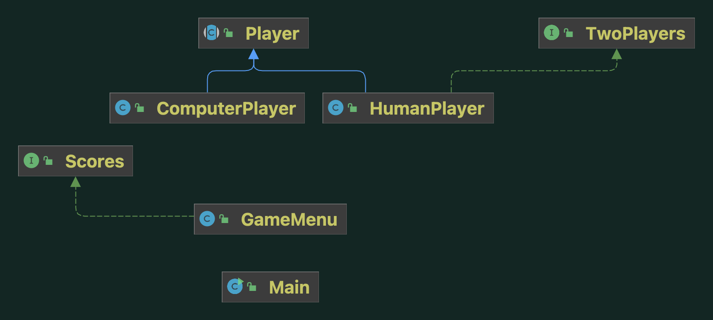
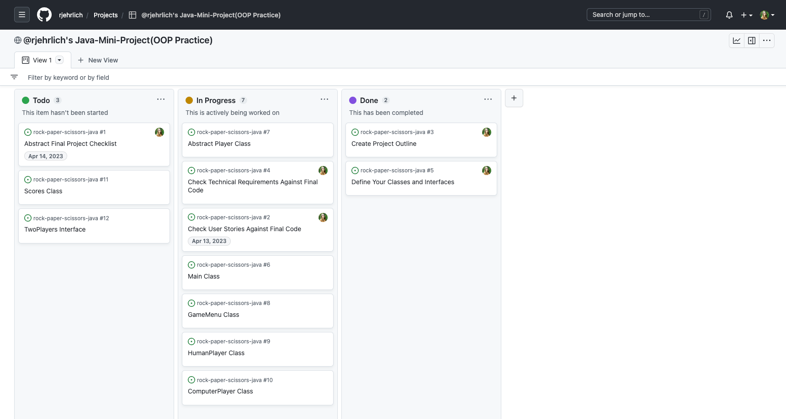

# A Game of Rock-Paper-Scissors

## Technologies Used
* Java

***
## Approach/ Project Plan 
My approach overview will go here.

### Created Class Diagram

### Outlined Basic Logic/ Plan
#### Main Class: 
  * for starting/initializing the game
#### GameMenu Class implements Scores: 
  * the game play logic, the scores, player choices, calculate winner, and overall game mechanism
#### Player (abstract class): 
  * what all players of the game must implement like a name, their choice, options for choice 
#### HumanPlayer Class extends Player: 
  * scanner will grab player prompt/ choice for game
#### ComputerPlayer extends Player: additional logic for randomizing a computers output choice
#### Scores Interface: 
  * ensures logic for determining & displaying winner is ALWAYS shown

### Used Agile Project Planning

***
## Mistakes or Things I Learned Along the Way
* I made a lot of mistakes along the way on this project. The biggest hurdle for
me was understanding Scope within the context of classes and subclasses

***
## Unsolved Problems/ What I Would Work On Next
* 